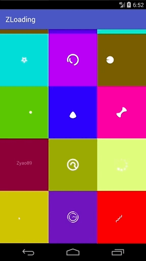
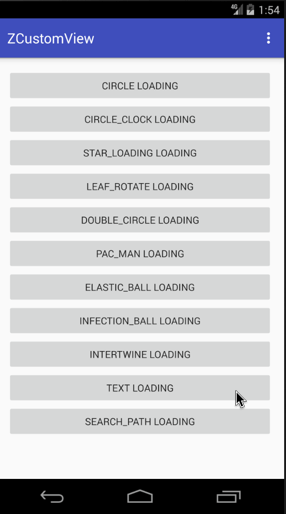
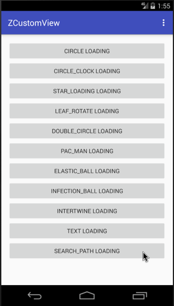
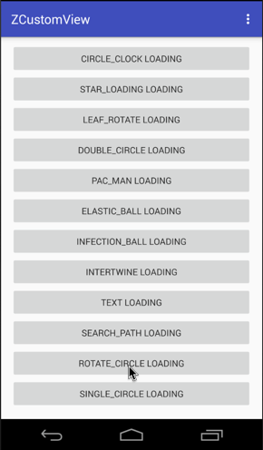
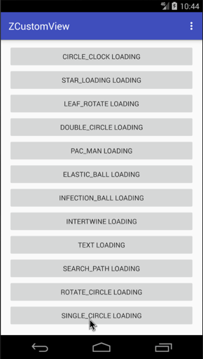
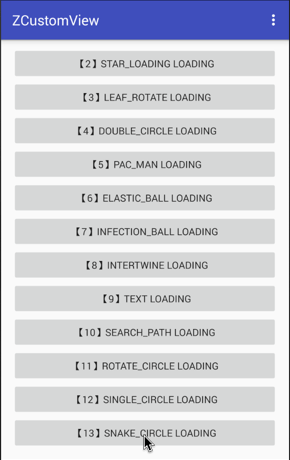
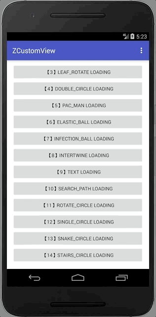
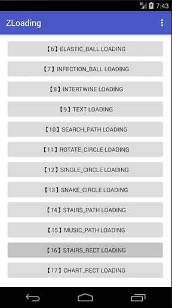

# ZLoading
这是一个自定义控件合集。目前包含Loading View。持续更新中...

### 引入
1. Gradle方式引用
```gradle
compile 'com.zyao89:zloading:1.2.0'
```

### 更新说明
> - **1.2.0** 开放 DEFAULT_SIZE 修改, 修复解决[#11](https://github.com/zyao89/ZLoading/issues/11) [#12](https://github.com/zyao89/ZLoading/issues/12)
> - **1.1.2** 更新修复 setDialogBackgroundColor 接口支持透明度设置，解决[#10](https://github.com/zyao89/ZLoading/issues/10)
> - **1.1.1** 新增 等待框背景色设置接口 setDialogBackgroundColor(Color.parseColor("#111111"))。
> - **1.1.0** 新增 动画倍速设置 setDurationTime(0.5) （建议不要低于0.3倍速，否则显示效果不是很好）。
> - **1.0.11** 新增 STAIRS_RECT 和 CHART_RECT 类型动画（详细见下方）。
> - **1.0.10** 新增 MUSIC_PATH 类型动画（详细见下方）。
> - **1.0.9** 新增 STAIRS_PATH 类型动画（详细见下方）。
> - **1.0.8** 新增 SNAKE_CIRCLE 类型动画（详细见下方）。
> - **1.0.7** 新增 SINGLE_CIRCLE 类型动画， 
    修复 TEXT 类型简单缺陷。
    增加 TEXT、RotateCircleBuilder 类型的使用说明。
> - **1.0.6** 增加字号设置，颜色设置， 解决[#2](https://github.com/zyao89/ZLoading/issues/2)
    补充说明：设置字号后，提示文字不再有动画

### 使用方式：
1. XML:
```xml
<com.zyao89.view.zloading.ZLoadingView
    android:layout_width="wrap_content"
    android:layout_height="wrap_content"
    app:z_type="CircleBuilder"
    app:z_color="@color/colorAccent"/>
```
`z_type` 选择加载动画的类型，就是下面介绍的这些；
`z_color` 设置加载动画的颜色；

2. Java
```java
ZLoadingView zLoadingView = (ZLoadingView) findViewById(R.id.loadingView_1);
zLoadingView.setLoadingBuilder(Z_TYPE.CIRCLE);//设置类型
// zLoadingView.setLoadingBuilder(Z_TYPE.values()[type], 0.5); //设置类型 + 动画时间百分比 - 0.5倍
zLoadingView.setColorFilter(Color.WHITE);//设置颜色
```

3. 【新增】Dialog对话框模式
```java
ZLoadingDialog dialog = new ZLoadingDialog(MainActivity.this);
dialog.setLoadingBuilder(type)//设置类型
        .setLoadingColor(Color.RED)//颜色
        .setHintText("Loading...")
        .setHintTextSize(16) // 设置字体大小 dp
        .setHintTextColor(Color.GRAY)  // 设置字体颜色
        .setDurationTime(0.5) // 设置动画时间百分比 - 0.5倍
        .setDialogBackgroundColor(Color.parseColor("#CC111111")) // 设置背景色，默认白色
        .show();
```

效果如下：




---

### 目前拥有的类型：
索引 | 类名 | 枚举值（Z_TYPE）| 昵称 
:------:|:------:|:------:|:-------:
0|CircleBuilder | CIRCLE | 圆
1|ClockBuilder | CIRCLE_CLOCK | 计时器
2|StarBuilder | STAR_LOADING | 跳舞的星星
3|LeafBuilder | LEAF_ROTATE | 旋转的叶子
4|DoubleCircleBuilder | DOUBLE_CIRCLE | 画两个圈圈
5|PacManBuilder | PAC_MAN | PacMan
6|ElasticBallBuilder | ELASTIC_BALL | 颤抖吧！球球
7|InfectionBallBuilder | INFECTION_BALL | 感染体
8|IntertwineBuilder | INTERTWINE | 交织
9|TextBuilder | TEXT | 文字
10|SearchPathBuilder | SEARCH_PATH | 搜索等待
11|RotateCircleBuilder | ROTATE_CIRCLE | 多圆旋转
12|SingleCircleBuilder | SINGLE_CIRCLE | 单圆简单动画
13|SnakeCircleBuilder | SNAKE_CIRCLE | 引蛇出洞
14|StairsPathBuilder | STAIRS_PATH | 舞动阶梯
15|MusicPathBuilder | MUSIC_PATH | 跳动音符
16|StairsRectBuilder | STAIRS_RECT | 递增方块
17|ChartRectBuilder | CHART_RECT | 跳动的柱状图


### 效果图如下

[第一个，ClockBuilder](markdown/Android自定义动画-ClockLoadingView.md)


[第二个，StarBuilder](https://zyao89.cn/s-12773350)


[第三个，LeafBuilder](https://zyao89.cn/s-5a6b347e)


[第四个，DoubleCircleBuilder](https://zyao89.cn/s-62c173ea)


[第五个，PacManBuilder](https://zyao89.cn/s-39d73c5c)


[第六个，ElasticBallBuilder](https://zyao89.cn/s-17fd94b6)


[第七个，InfectionBallBuilder](https://zyao89.cn/s-3e943576)


[第八个，IntertwineBuilder](https://zyao89.cn/s-3cf24ca7)


[第九个，TextBuilder](https://zyao89.cn/s-7db9f766)



[第十个，SearchPathBuilder](https://zyao89.cn/s-7db9f766)



[第十一个，RotateCircleBuilder](https://zyao89.cn/s-6b0fa535)



[第十二个，SingleCircleBuilder](https://zyao89.cn/s-6b0fa535)



[第十三个，SnakeCircleBuilder](https://zyao89.cn/s-0fbb1b3a)



[第十四个，StairsPathBuilder](https://zyao89.cn/s-6b0fa535)



[第十五个，MusicPathBuilder](https://zyao89.cn/s-011d4a04)


[第十六个，StairsRectBuilder](https://zyao89.cn/s-4c67d8d3)



[第十七个，ChartRectBuilder](https://zyao89.cn/s-6b0fa535)


更多可访问 [zyao89.cn](https://zyao89.cn/s-6b0fa5356)


### License
```
   Copyright 2017 zyao89

   Licensed under the Apache License, Version 2.0 (the "License");
   you may not use this file except in compliance with the License.
   You may obtain a copy of the License at

     http://www.apache.org/licenses/LICENSE-2.0

   Unless required by applicable law or agreed to in writing, software
   distributed under the License is distributed on an "AS IS" BASIS,
   WITHOUT WARRANTIES OR CONDITIONS OF ANY KIND, either express or implied.
   See the License for the specific language governing permissions and
   limitations under the License.
```
