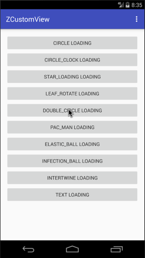
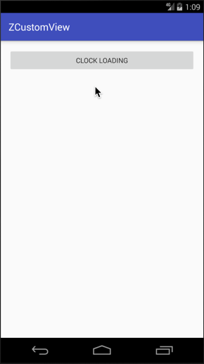
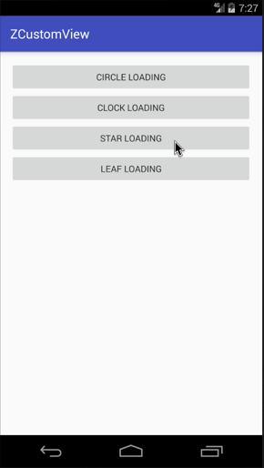
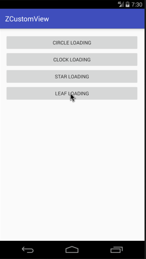
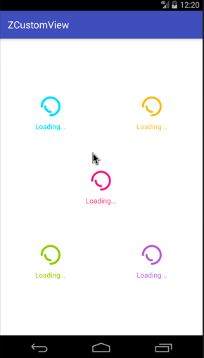
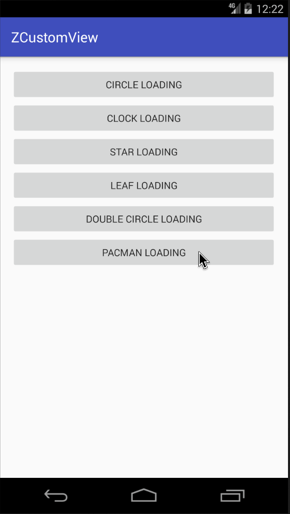
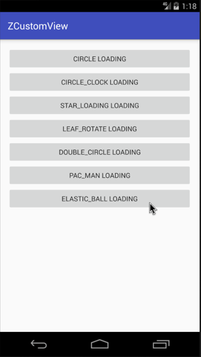
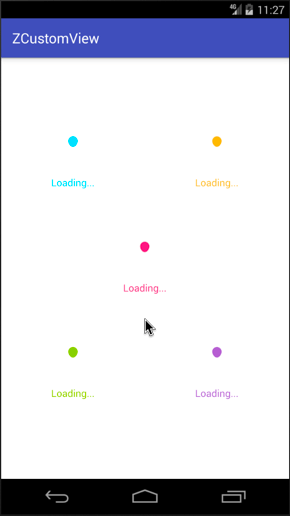

# ZCustomView
这是一个自定义控件合集。目前包含Loading View。持续更新中...

### 使用方式：
1. XML:
```xml
<com.zyao89.view.zloading.ZLoadingView
    android:layout_width="wrap_content"
    android:layout_height="wrap_content"
    app:z_type="CircleBuilder"
    app:z_color="@color/colorAccent"/>
```
`z_type` 选择加载动画的类型，就是下面介绍的这些；
`z_color` 设置加载动画的颜色；

2. Java
```java
ZLoadingView zLoadingView = (ZLoadingView) findViewById(R.id.loadingView_1);
zLoadingView.setLoadingBuilder(Z_TYPE.CIRCLE);//设置类型
zLoadingView.setColorFilter(Color.WHITE);//设置颜色
```

3. 【新增】Dialog对话框模式
```java
ZLoadingDialog dialog = new ZLoadingDialog(MainActivity.this);
dialog.setLoadingBuilder(type)//设置类型
        .setLoadingColor(Color.BLACK)//颜色
        .setHintText("Loading...")
        .show();
```

效果如下：




---

### 目前拥有的类型：
索引 | 名称 | 枚举值（Z_TYPE）
:------:|:------:|:------:
0|CircleBuilder | CIRCLE
1|ClockBuilder | CIRCLE_CLOCK
2|StarBuilder | STAR_LOADING
3|LeafBuilder | LEAF_ROTATE
4|DoubleCircleBuilder | DOUBLE_CIRCLE
5|PacManBuilder | PAC_MAN
6|ElasticBallBuilder | ELASTIC_BALL
7|InfectionBallBuilder | INFECTION_BALL
8|IntertwineBuilder | INTERTWINE
9|TextBuilder | TEXT


### 效果图如下

[第一个，ClockBuilder](markdown/Android自定义动画-ClockLoadingView.md)



[第二个，StarBuilder](http://zyao89.github.io/2017/03/22/Android自定义动画-StarLoadingView/)



[第三个，LeafBuilder](http://zyao89.me/2017/03/22/旋转的叶子-LeafLoadingView/)



[第四个，DoubleCircleBuilder](http://zyao89.me/2017/03/25/Android自定义加载动画-DoubleCircleBuilder/)



[第五个，PacManBuilder](http://zyao89.me/2017/03/26/Android自定义加载动画-PacMan/)



[第六个，ElasticBallBuilder](http://zyao89.me/2017/03/27/Android自定义加载动画-颤抖吧！球球/)



[第七个，InfectionBallBuilder](http://zyao89.me/2017/04/06/Android自定义加载动画-感染体/)



[第八个，IntertwineBuilder](http://zyao89.me/2017/04/06/Android自定义加载动画-交织/)


### License
```
   Copyright 2017 zyao89

   Licensed under the Apache License, Version 2.0 (the "License");
   you may not use this file except in compliance with the License.
   You may obtain a copy of the License at

     http://www.apache.org/licenses/LICENSE-2.0

   Unless required by applicable law or agreed to in writing, software
   distributed under the License is distributed on an "AS IS" BASIS,
   WITHOUT WARRANTIES OR CONDITIONS OF ANY KIND, either express or implied.
   See the License for the specific language governing permissions and
   limitations under the License.
```